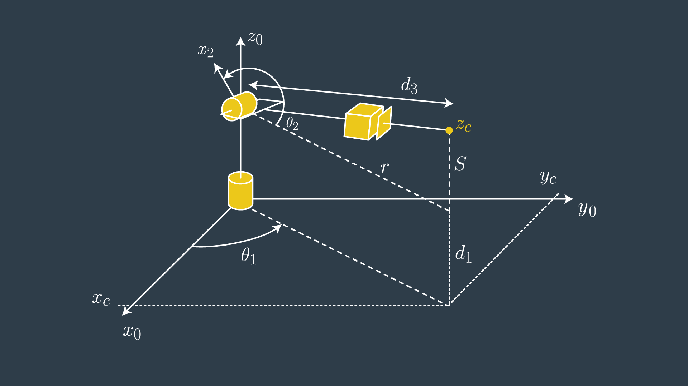

# Project: Kinematics Pick & Place

## Kinematic Analysis

### 1. Run the forward_kinematics demo and evaluate the kr210.urdf.xacro file to perform kinematic analysis of Kuka KR210 robot and derive its DH parameters.

>Your writeup should contain a DH parameter table with proper notations and description about how you obtained the table. Make sure to use the modified DH parameters discussed in this lesson. Please add an annotated figure of the robot with proper link assignments and joint rotations (Example figure provided in the writeup template). It is strongly recommended that you use pen and paper to create this figure to get a better understanding of the robot kinematics.

DH parameter table is obtained using the following figure (provided in lessons) and urdf file.

#### anotated figure with proper link assginments and joint rotations


#### anotated figure with urdf information (obtained from [kr210.urdf.xacro](https://github.com/msrks/RoboND-Kinematics-Project/blob/master/kuka_arm/urdf/kr210.urdf.xacro))


#### DH Parameter table

To reduce the none zero value in DH Parameter Table, the assignment of the axis in lessons is different from the one defined in the urdf file. For example, the z-offset of Axis-1 is calculated as (0.33 + 0.42 = 0.75).

Links | alpha(i-1) | a(i-1) | d(i) | theta(i)
----- | --- | --- | --- | ---
0->1 | 0 | 0 | 0.75 | q1
1->2 | -pi/2 | 0.35 | 0 | q2 - pi/2
2->3 | 0 | 1.25 | 0 | q3
3->4 | -p1/2 | -0.054 | 1.50 | q4
4->5 | pi/2 | 0 | 0 | q5
5->6 | -pi/2 | 0 | 0 | q6
6->EE | 0 | 0 | 0.303 | 0

### 2. Using the DH parameter table you derived earlier, create individual transformation matrices about each joint. In addition, also generate a generalized homogeneous transform between base_link and gripper_link using only end-effector(gripper) pose.

>Your writeup should contain individual transform matrices about each joint using the DH table and a homogeneous transform matrix from base_link to gripper_link using only the position and orientation of the gripper_link. These matrices can be created using any software of your choice or hand written. Also include an explanation on how you created these matrices.

DH transform matrix is obtaind by four individual transforms


It turn out to be the following (where cx represents cos(x) and sx represents sin(x))


I used `sympy` library for symbollic computation

```python
import numpy as np
from numpy import array
from sympy import symbols, cos, sin, pi, simplify, sqrt, atan2
from sympy.matrices import Matrix

### Create symbols for joint variables
q1, q2, q3, q4, q5, q6, q7 = symbols('q1:8') # theta_i
d1, d2, d3, d4, d5, d6, d7 = symbols('d1:8')
a0, a1, a2, a3, a4, a5, a6 = symbols('a0:7')
alpha0, alpha1, alpha2, alpha3, alpha4, alpha5, alpha6 = symbols('alpha0:7')

### Kuka KR210 ###
# DH Parameters
s = {alpha0:     0, a0:      0, d1:  0.75,
     alpha1: -pi/2, a1:   0.35, d2:     0,  q2: q2-pi/2,
     alpha2:     0, a2:   1.25, d3:     0,
     alpha3: -pi/2, a3: -0.054, d4:  1.50,
     alpha4:  pi/2, a4:      0, d5:     0,
     alpha5: -pi/2, a5:      0, d6:     0,
     alpha6:     0, a6:      0, d7: 0.303,  q7: 0 }
```

```python
# Homogenious Transforms Matrix given DH parameters  
def tf_matrix(alpha, a, d, q):
    mat =  Matrix([[            cos(q),           -sin(q),           0,             a],
                   [ sin(q)*cos(alpha), cos(q)*cos(alpha), -sin(alpha), -sin(alpha)*d],
                   [ sin(q)*sin(alpha), cos(q)*sin(alpha),  cos(alpha),  cos(alpha)*d],
                   [                 0,                 0,           0,             1]])

    return mat
```

```python
# Homogenious Transforms between Individual Neighboring Links
T0_1 = tf_matrix(alpha0, a0, d1, q1).subs(s)
T1_2 = tf_matrix(alpha1, a1, d2, q2).subs(s)
T2_3 = tf_matrix(alpha2, a2, d3, q3).subs(s)
T3_4 = tf_matrix(alpha3, a3, d4, q4).subs(s)
T4_5 = tf_matrix(alpha4, a4, d5, q5).subs(s)
T5_6 = tf_matrix(alpha5, a5, d6, q6).subs(s)
T6_EE = tf_matrix(alpha6, a6, d7, q7).subs(s)
T0_EE = T0_1 * T1_2 * T2_3 * T3_4 * T4_5 * T5_6 * T6_EE
```


```python
# Rotation Matrix about Y
def rot_y(q):
    R_y = Matrix([[  cos(q),       0,  sin(q) ],
                  [       0,       1,       0 ],
                  [ -sin(q),       0,  cos(q) ]])
    return R_y

# Rotation Matrix about Z
def rot_z(q):
    R_z = Matrix([[  cos(q), -sin(q),       0 ],
                  [  sin(q),  cos(q),       0 ],
                  [       0,       0,       1 ]])
    return R_z

T_total = T0_EE * rot_z(pi) * rot_y(-pi/2)
```

#### individual transform matrices about each joint using the DH table

```python
>>> T0_1
Matrix([
[cos(q1), -sin(q1), 0,    0],
[sin(q1),  cos(q1), 0,    0],
[      0,        0, 1, 0.75],
[      0,        0, 0,    1]])

>>> T1_2
Matrix([
[sin(q2),  cos(q2), 0, 0.35],
[      0,        0, 1,    0],
[cos(q2), -sin(q2), 0,    0],
[      0,        0, 0,    1]])

>>> T2_3
Matrix([
[cos(q3), -sin(q3), 0, 1.25],
[sin(q3),  cos(q3), 0,    0],
[      0,        0, 1,    0],
[      0,        0, 0,    1]])

>>> T3_4
Matrix([
[ cos(q4), -sin(q4), 0, -0.054],
[       0,        0, 1,    1.5],
[-sin(q4), -cos(q4), 0,      0],
[       0,        0, 0,      1]])

>>> T4_5
Matrix([
[cos(q5), -sin(q5),  0, 0],
[      0,        0, -1, 0],
[sin(q5),  cos(q5),  0, 0],
[      0,        0,  0, 1]])

>>> T5_6
Matrix([
[ cos(q6), -sin(q6), 0, 0],
[       0,        0, 1, 0],
[-sin(q6), -cos(q6), 0, 0],
[       0,        0, 0, 1]])

>>> T6_EE
Matrix([
[1, 0, 0,     0],
[0, 1, 0,     0],
[0, 0, 1, 0.303],
[0, 0, 0,     1]])
```

#### 3. Decouple Inverse Kinematics problem into Inverse Position Kinematics and inverse Orientation Kinematics; doing so derive the equations to calculate all individual joint angles.

>Based on the geometric Inverse Kinematics method described here, breakdown the IK problem into Position and Orientation problems. Derive the equations for individual joint angles. Your writeup must contain details about the steps you took to arrive at those equations. Add figures where necessary. If any given joint has multiple solutions, select the best solution and provide explanation about your choice (Hint: Observe the active robot workspace in this project and the fact that some joints have physical limits).

theta1 is easily obtained using the following equation.

```python
theta1 = atan2(wy, wx).evalf(subs=s)
```


theta2 and theta3 are obtaind using the following equations (Triangle Laws)

```python
# triangle sides
A = a2
B = sqrt(a3**2 + d4**2)
C = sqrt((sqrt(wx**2 + wy**2)-a1)**2 + (wz - d1)**2)

# apply law of cosines
cos_gamma = (A**2 + C**2 - B**2) / (2 * A * C)
gamma = atan2(sqrt(1-cos_gamma**2), cos_gamma)
cos_beta = (A**2 + B**2 - C**2) / (2 * A * B)
beta = atan2(sqrt(1-cos_beta**2), cos_beta)

theta2 = (pi/2 - gamma - atan2(wz-d1, sqrt(wx**2 + wy**2) - a1)).subs(s)
theta3 = (pi/2 - beta - atan2(abs(a3), d4)).subs(s)
```



theta4 and theta5 and theta6 are obtaind using the following equations (Euler-Angle Decomposition)

```python
# rotation matrix from joint 3 to joint 6,
R0_3_inv = Transpose(R0_3.evalf(subs={q1: theta1, q2: theta2, q3: theta3}))
R3_6 = (R0_3_inv * Rrpy).evalf()

# Euler angle decomposition
theta4 = atan2(R3_6[2,2], -R3_6[0,2])
theta5 = atan2(sqrt(R3_6[1,0]**2 + R3_6[1,1]**2), R3_6[1,2])
theta6 = atan2(-R3_6[1,1], R3_6[1,0])
```

## Project Implementation

### 1. Fill in the `IK_server.py` file with properly commented python code for calculating Inverse Kinematics based on previously performed Kinematic Analysis. Your code must guide the robot to successfully complete 8/10 pick and place cycles. Briefly discuss the code you implemented and your results.

>IK_server.py must contain properly commented code. The robot must track the planned trajectory and successfully complete pick and place operation. Your writeup must include explanation for the code and a discussion on the results.

Implementaiton is [here](https://github.com/msrks/RoboND-Kinematics-Project/blob/master/kuka_arm/scripts/IK_server.py)).

the result is perfect success!
