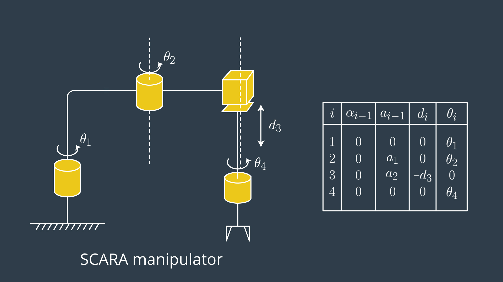

# DH Paramter

a: dist (z-axis)
d: dist (x-axis)
theta: angle (z-axis)
alpha: angle (x-axis)

# DH Parameter Assignment

1. label joints
2. label links
3. define joint-axes
4. `common normal?` : joint-axes 同士の接続を定義する
5. assign z-axis
6. assign x-axis

# FK

the total transform between adjacent links

# IK

2つ方法がある。

1つは数値解析的にとく。iteration。

>The first is a purely numerical approach. Essentially, this method is guess and iterate until the error is sufficiently small or it takes so long that you give up. The Newton-Raphson algorithm is a common choice because it is conceptually simple and has a quadratic rate of convergence if the initial guess is "sufficiently close" to the solution. However, there is no guarantee that the algorithm will converge or do so quickly enough to meet application requirements and it only returns one solution. To generate solutions for the various possible poses, different initial conditions must be used. The advantage of the numerical approach is that the same algorithm applies to all serial manipulators.

2つ目は分析的にとく。こっちの方がいい。先っちょ（End-Effector)から逆算していく。

>The other, and much preferred, solution method is a known as an "analytical" or “closed-form” solution. Closed-form solutions are specific algebraic equation(s) that do not require iteration to solve and have two main advantages: generally they are much faster to solve than numerical approaches and it is easier to develop rules for which of the possible solutions is the appropriate one. However, only certain types of manipulators are solvable in closed-form. The obvious question is, so what types of manipulators have a closed-form solution? Research has shown that if either of the following two conditions are satisfied, then the serial manipulator is solvable in closed-form.
>
1. Three neighboring joint axes intersect at a single point, or
2. Three neighboring joint axes are parallel (which is technically a special case of 1, since parallel lines intersect at infinity)

最近の産業用ロボットは大体、分析的に解ける

>Fortunately, the majority of six DoF serial manipulators currently used in industry will satisfy one of the above conditions.
